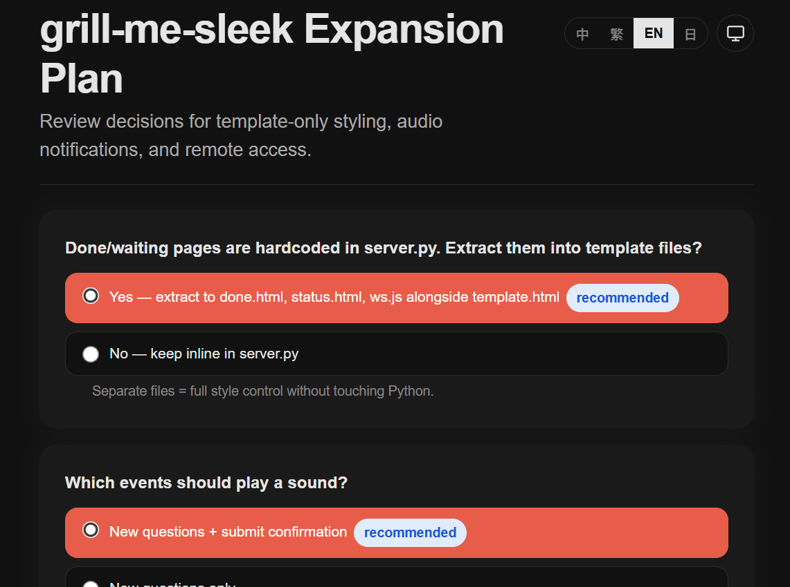
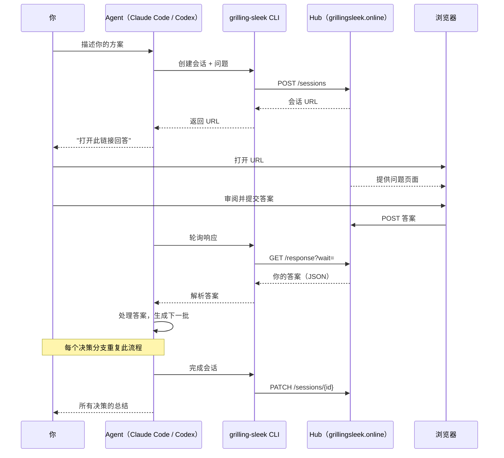

[English](./README.md) | 简体中文

<div align="center">

# grill-me-sleek

**Vibe coding 之前，先把需求对齐。**

Agent 帮你把方案里的坑都找出来，再动手写代码。

<br />



<br />

[](LICENSE) [](https://github.com/jukanntenn/grill-me-sleek) [](https://github.com/jukanntenn/grill-me-sleek)

</div>

---

## 快速开始

以下以 Claude Code 为例，后续会支持更多工具，见[平台支持](#平台支持)。

```bash
/plugin marketplace add jukanntenn/grill-me-sleek
/plugin install grill-me-sleek@jukanntenn
```

输入以下内容即可触发：

> *"Grill me on my plan to migrate the auth service to OAuth 2.0"*

Agent 会一次生成所有问题，在浏览器打开页面等你回答。如果有新问题，下一批会在同一个标签页自动加载。

## 功能说明

你描述一个方案，Agent 帮你找出里面的问题、假设和不确定的地方，一次性列出来。

1. 你描述方案或设计。
2. Agent 分析后生成一批问题，每个问题附带推荐答案和备选项。
3. 你在网页上批量审阅，选答案，提交。
4. Agent 收到回答后继续处理。如果有新问题，下一批在同一个标签页自动加载，不用手动刷新。

不用在终端里一问一答，不用翻半天才看到问题，快速过完方案。

## 工作流程



每批问题变成一个网页，你在浏览器里审阅并提交。Hub 托管 UI，不需要本地服务器。

## grill-me-sleek vs grill-me

|  | grill-me-sleek | grill-me |
|---|---|---|
| **提问方式** | ⚡ 一次性出完，在网页里 | 逐个追问，在终端里 |
| **推荐答案** | ✅ 全部预选好，批量审阅 | 有，但需要逐个确认 |
| **多轮迭代** | 🔄 自动——下一批在同一标签页加载 | 手动来回对话 |
| **界面** | 🖥️ 浏览器，排版清晰 | 只有终端 |
| **浏览器支持** | 🌐 macOS、Linux、WSL 自动打开 | 不适用 |
| **审阅耗时** | ⏱️ 通常 ≤ 5 分钟 | 通常 10~30 分钟 |

## 平台支持

| 平台 | 状态 |
|---|---|
| Claude Code | ✅ 已支持 |
| OpenAI Codex | ⚡ 已支持（手动安装） |
| OpenCode | 🔜 计划中 |
| Trae | 🔜 计划中 |

## 安装

**前置条件：** Node.js ≥ 22

### CLI 安装

CLI 通过 npm 分发。全局安装：

```bash
npm install -g @grilling-sleek/cli
```

或直接使用 npx：

```bash
npx @grilling-sleek/cli --help
```

### Claude Code（marketplace 安装）

```bash
/plugin marketplace add jukanntenn/grill-me-sleek
/plugin install grill-me-sleek@jukanntenn
```

### OpenAI Codex（手动安装）

```bash
git clone https://github.com/jukanntenn/grill-me-sleek.git
# 用户级（所有项目可用）
cp -r grill-me-sleek/skills/grilling-sleek ~/.agents/skills/
# 或项目级（仅当前项目）
# cp -r grill-me-sleek/skills/grilling-sleek .agents/skills/
```

安装后重启 Codex，skill 在所有新会话中可用。

## 使用场景

| 你想做什么 | 可以这样说 |
|---|---|
| 评审架构选择 | *"Grill me on choosing gRPC over REST for the payment service"* |
| 验证迁移方案 | *"Grill me on my plan to migrate from MySQL to PostgreSQL"* |
| 对齐项目规划 | *"Grill me on the roadmap for the new dashboard feature"* |
| 确认调试思路 | *"Grill me on my approach to fixing the memory leak in the worker pool"* |

## 许可证

[MIT](LICENSE) © jukanntenn
